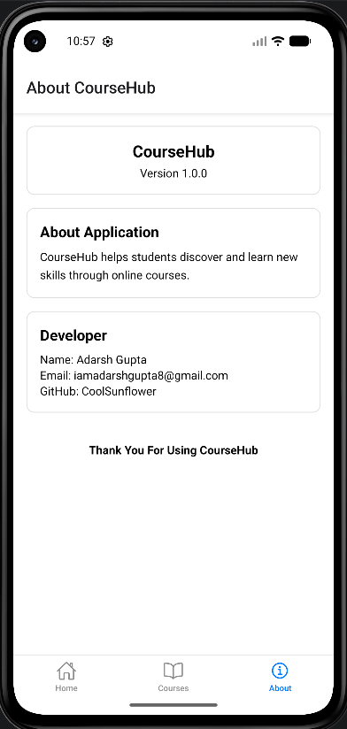

# CourseHub - Online Learning Mobile App

A React Native application that allows users to browse courses and view course information through different screens.

## Original Specification

```
Description
Develop an Online Learning Mobile Application that allows users to browse courses and view course information through different screens. The application should display courses using modern card layouts.

Screens Required
- Home Screen
- Courses Screen
- Course Details Screen
- About Screen

Fields
- Course Name
- Instructor Name
- Duration
- Fee
- Rating
- Description

Implement
- Page Navigation
- Bottom Tab Navigation
- Course Card Display
- Course Details Screen
- Search Courses
- Responsive Design

Additional Features
- Featured Courses Section
- Popular Courses List
- About Application Screen
```

## UI Screens




## UI Design

### Home Screen

The home screen will display the following:

- Application Name (in Header)
- Featured Courses Scrolling Banner
- Popular Courses Flatlist (Each Course will be represented by a reusable CourseCard Component)

Clicking any course (in banner or flatlist) will take the user to its Course Details page.

```
CourseHub
-------------------------
Featured Courses
+-----------------------+
|                       |
|      CourseCard       |
|                       |
+-----------------------+
           ...

Popular Courses

   +--------+ +--------+
   |        | |        |
   |        | |        |
   +--------+ +--------+
   +--------+ +--------+
   |        | |        |
   |        | |        |
   +--------+ +--------+

```

### Courses Screen

The All Courses Screen will show a Flatlist display of all Courses. (Each Course will be represented by a reusable CourseCard Component)

This page will also allow grouping of courses and looking at a specific type of courses (Subject Wise Grouping).

```
Courses
-------------------------
+-----------------------+
|Search...              |
+-----------------------+

+---+ +--------+ +--------+
|All| | Sub. 1 | | Sub. 2 |...
+---+ +--------+ +--------+

   +--------+ +--------+
   |        | |        |
   |        | |        |
   +--------+ +--------+
   +--------+ +--------+
   |        | |        |
   |        | |        |
   +--------+ +--------+

```

### Course Details Screen

The Course Details Screen will show details of the selected course using local route parameters, it can be accessed from Home or Course Screens. This screen will be added using Stack Navigation on top of the base Tabs Layout of all other tabs.

This screen will display the following:

- Course Code
- Course Title
- Instructor Name
- Language
- Duration
- Fee
- Rating
- Description, Skills
- Enroll Now with Link

```
-------------------------
<- Course Details
-------------------------
[Code: <CourseCode>]

<Title> (Rating: <Out of 5 Stars>)

Instructors
<Name of Instructors>

Language
<Language of Instruction>

Duration
<Duration of Course>

Fee
<Price for Access>

-------------------------
Description
-------------------------

<Short Intro About Course>

Skills
<Skills developed>

-------------------------
[ Enroll Now ] (will link to URL)
-------------------------
```

Data Source: https://www.kaggle.com/datasets/khaledatef1/online-courses

### About Screen

This screen will display information about the application & the developer.

```
--------------------------------
About CourseHub
--------------------------------

           CourseHub
         Version 1.0.0

--------------------------------
About Application
--------------------------------

CourseHub helps students discover
and learn new skills through online
courses.

--------------------------------
Developer
--------------------------------

Name: Adarsh Gupta
Email: iamadarshgupta8@gmail.com
GitHub: CoolSunflower

--------------------------------
Thank You For Using CourseHub
--------------------------------
```

### CourseCard Component

This will have two versions:

1. For Banner, will display more information
2. For Flatlist everywhere else with more compact information

```
+----------------------------------+
| <CourseCode>                     |
| <CourseTitle>                    |
|                                  |
| Rating: 4.8/5                    |
|                                  |
| <Instructor>                     |
| English                          |
| 12 Weeks                         |
|                                  |
| Price                            |
+----------------------------------+

+------------------------------------------------+
| Featured                                       |
| <CourseCode>                                   |
| <CourseTitle>                                  |
| 4.8/5           <Instructor>                   |
| English         12 Weeks                       |
| <Price>                                        |
+------------------------------------------------+
```

## Data Types

1. The Course Data Type will have: code, title, instructor, language, duration, fee, rating, description, prerequisities, skills, category, enrollUrl.
2. Features & Popular Courses will be maintained as an array of CourseCodes.
3. Data of all courses will be saved as a map from CourseCode to CourseData Type object.
4. For navigation, we will pass route parameter of CourseCode

## Installation & Setup

Prerequisites: Node.js, npm, Expo CLI, Android Studio (Emulator)

```
// Clone Repository
git clone https://github.com/CoolSunflower/CourseHub
cd CourseHub

// Install Dependencies
npm install

// Run the application
npx expo start
OR npm run android
```

### Project Structurre

```
CourseHub
| - assets
| - src
   |app
      | (tabs)
         | - _layout.tsx, about.tsx, courses.tsx, index.tsx
      | _layout.tsx
      | courseDetails.tsx
   |data
      | courses.ts
   |types
      | Course.ts
| package.json
```
